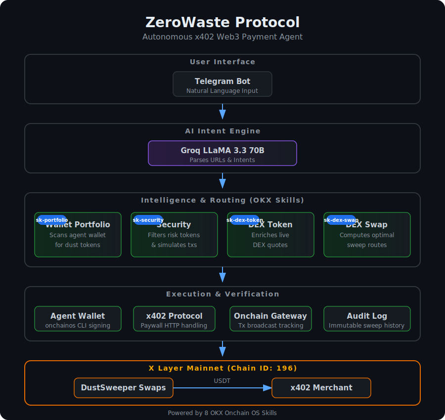
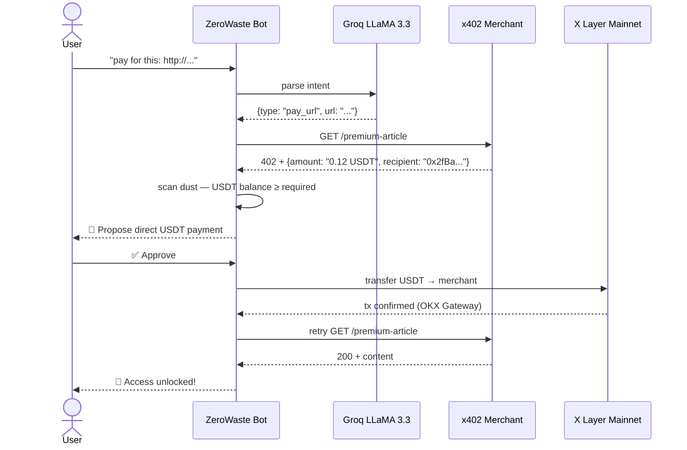
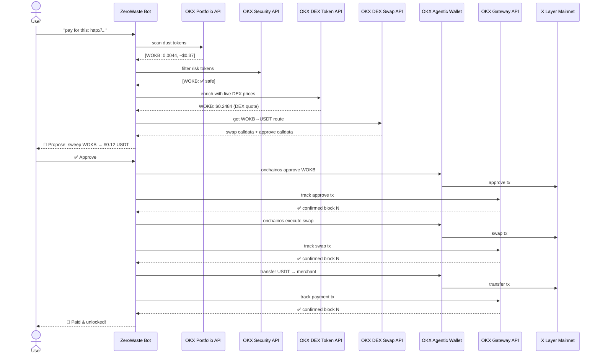
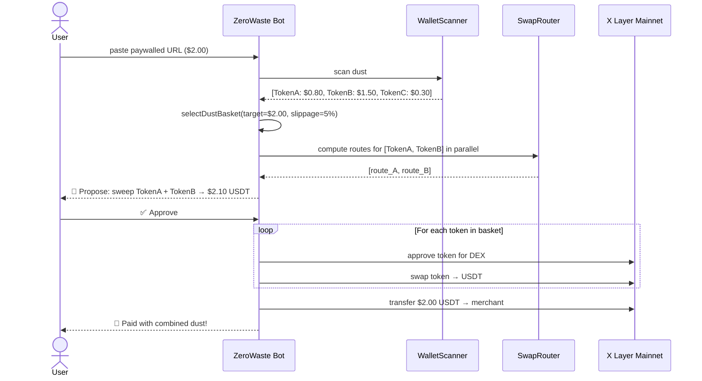

# ZeroWaste Protocol 🧹

> **Pay x402 paywalls with your wallet's trash.** An AI-powered Web3 payment agent that converts worthless "dust" tokens into stablecoin payments on X Layer — conversationally, autonomously, and with zero manual swaps.

[-orange)](https://www.okx.com/xlayer)
[](https://web3.okx.com/onchain-os)
[](https://dorahacks.io/hackathon/okx-xlayer/detail)
[](LICENSE)

---

## 🎯 What It Does

You have $0.20 of WOKB, $1.50 of some token, and $0.80 of another sitting idle in your wallet — worthless individually for buying anything, but together covering a $2.00 paywall. **ZeroWaste Protocol eliminates that waste.**

Just tell the bot what you want to pay for. In plain English. It handles everything else.

```
You:  "pay for this article: http://content.xyz/premium-story"
Bot:  💬 Got it, checking that paywall for you!
      🔗 Checking paywall at: http://content.xyz/premium-story
      ⚠️ x402 Payment Required — $0.12 USDT
      🔍 Scanning your dust...  2 safe tokens, $0.26 total
      📊 WOKB live price: $0.2484 (DEX-validated)
      💱 Proposed: Sweep 0.00145 WOKB → $0.12 USDT → pay merchant
      [✅ Approve & Pay]  [❌ Cancel]
  → User taps Approve
      ✅ Swap confirmed (OKX Gateway — block 57495189)
      ✅ Merchant paid (OKX Gateway — block 57495194)
      🎉 Access unlocked! Here's your content...
```

---

## 🏗️ Architecture



### System Layers

| Layer | Components |
|---|---|
| **User Interface** | Telegram Bot with inline keyboards |
| **AI Layer** | Groq LLaMA 3.3 70B — Natural language intent parsing |
| **Core Services** | WalletScanner · TxSimulator · TokenEnricher · SwapRouter |
| **Execution** | OKX Agentic Wallet (onchainos CLI) · OKX Gateway tracking |
| **Blockchain** | X Layer Mainnet (Chain ID: 196) |

---

## 🔧 OKX Onchain OS Skills (8 Integrated)

| Skill | Integration | What It Does |
|---|---|---|
| `okx-agentic-wallet` | `AgenticWallet.ts` | TEE-secured agent wallet per user — signs every tx via onchainos CLI with mutex protection |
| `okx-wallet-portfolio` | `WalletScanner.ts` | Scans agent wallet for dust tokens on X Layer via OKX Portfolio API |
| `okx-dex-swap` | `SwapRouter.ts` | Computes optimal swap routes (dust → USDT) via OKX DEX Aggregator V6 across 500+ DEX sources |
| `okx-dex-token` | `TokenEnricher.ts` | Enriches dust token prices with live DEX quotes before basket selection for real-time accuracy |
| `okx-x402-payment` | `bot/index.ts` | Handles HTTP 402 payment protocol — detects paywalls, parses payment requirements |
| `okx-onchain-gateway` | `PaymentVerifier.ts` | Tracks transaction status post-broadcast via OKX Gateway API (`transaction-detail-by-txhash`) |
| `okx-security` | `TxSimulator.ts` | Pre-filters risk tokens from dust basket; validates txs via OKX pre-transaction API |
| `okx-audit-log` | `AuditLog.ts` | Queries on-chain transaction history for the `/history` command — immutable payment audit trail |

---

## 🔄 Payment Flow — Sequence Diagrams

### Scenario 1: Direct USDT Payment (Fast Path)



### Scenario 2: Single-Token Dust Sweep (Core Flow)



### Scenario 3: Multi-Token Basket Sweep



---

## 📄 Smart Contract

### `DustSweeperMulticall.sol`

Deployed on **X Layer Mainnet** (Chain ID: 196).

**Address:** [`0x1E52781EC86C99C972f30366dA493c780a54ED8c`](https://www.okx.com/web3/explorer/xlayer/address/0x1E52781EC86C99C972f30366dA493c780a54ED8c)

Provides an **atomic fallback path**: executes all swap calls in a single transaction, verifies total USDT output meets the x402 requirement, then forwards payment. If any swap produces insufficient USDT, the **entire transaction reverts** — protecting user tokens.

---

## 🤖 Bot Commands

| Command | Description |
|---|---|
| `/start` | Create your TEE-secured agent wallet |
| `/wallet` | View your agent wallet address + explorer link |
| `/dust` | Scan your agent wallet for dust tokens |
| `/setdust <amount>` | Set your personal dust threshold (e.g. `/setdust 5`) |
| `/history` | View your on-chain sweep payment history (audit log) |
| `/help` | Show all commands |
| _paste any URL_ | Detect paywall and initiate sweep payment |
| _natural language_ | "pay for this article [URL]", "how much dust do I have?" |

---

## 🚀 Setup & Run

### Prerequisites

- Node.js 18+
- [Telegram Bot Token](https://t.me/BotFather)
- [OKX API credentials](https://web3.okx.com/onchain-os/dev-portal) with `OK-ACCESS-PROJECT`
- [Groq API key](https://console.groq.com/keys) (for natural language parsing)
- OKB on X Layer for gas

### Installation

```bash
git clone https://github.com/Raksha001/ZeroWaste-Protocol.git
cd ZeroWaste-Protocol
npm install
```

### Configuration

```bash
cp .env.example .env
# Fill in your credentials:
# TELEGRAM_BOT_TOKEN=...
# OKX_API_KEY=...
# OKX_SECRET_KEY=...
# OKX_PASSPHRASE=...
# OKX_PROJECT_ID=...
# GROQ_API_KEY=...
# NETWORK=mainnet
```

### Run

```bash
# Start everything (merchant + bot)
npm run dev

# Or separately:
npm run start:merchant   # Mock x402 paywall server on :3001
npm run start:bot        # Telegram bot
```

### Test the Full Flow

```bash
# In Telegram, send to your bot:
http://localhost:3001/premium-article   # $0.12 paywall
http://localhost:3001/premium-news      # $0.30 paywall
http://localhost:3001/api-access        # $2.00 paywall
```

---

## 🏆 Hackathon Prize Alignment

| Prize Category | How ZeroWaste Protocol Qualifies |
|---|---|
| **Best x402 Application** | Complete end-to-end x402 implementation: paywall detection → payment → content unlock on X Layer Mainnet |
| **Most Active Agent** | Autonomous agent executes 3 on-chain transactions per payment (approve + swap + transfer) with real mainnet tx hashes |
| **Best MCP Integration** | onchainos CLI as the agentic wallet backbone; 8 OKX Onchain OS skills integrated |
| **Best Economy Loop** | Dust tokens (idle value) → USDT (active value) → merchant revenue → content access — a complete circular economy |

---

## 🔑 Key Design Decisions

- **OKX DEX Aggregator over raw DEX** — Better fill rates for small/illiquid dust token swaps on X Layer
- **Sequential approve → swap** over atomic multicall for primary path — more reliable with varied ERC20 approvals
- **WOKB as primary test token** — Native-wrapped OKB has deep liquidity guaranteeing DEX routing success
- **5% slippage buffer** in basket selection — accounts for price movement between quote and execution
- **Groq LLaMA 3.3 70B** — Fastest inference available, critical for a responsive Telegram bot feel
- **Mutex-protected wallet switching** — Prevents concurrent onchainos account conflicts for multi-user scenarios

---

## 📁 Project Structure

```
src/
├── bot/
│   └── index.ts              # Main bot logic, all command handlers
├── services/
│   ├── AgenticWallet.ts      # onchainos CLI wrapper (okx-agentic-wallet)
│   ├── WalletScanner.ts      # Dust token discovery (okx-wallet-portfolio)
│   ├── SwapRouter.ts         # DEX route computation (okx-dex-swap)
│   ├── TokenEnricher.ts      # Live price enrichment (okx-dex-token)
│   ├── TxSimulator.ts        # Risk filter + tx simulation (okx-security)
│   ├── PaymentVerifier.ts    # Tx confirmation (okx-onchain-gateway)
│   ├── AuditLog.ts           # Transaction history (okx-audit-log)
│   ├── IntentParser.ts       # Groq LLM intent parsing
│   ├── OkxApiClient.ts       # HMAC-authenticated OKX API client
│   └── UserWalletStore.ts    # Persistent user wallet + preferences
├── merchant/
│   └── server.ts             # Mock x402 paywall server
├── scripts/                  # Setup & funding utilities
└── config/
    └── network.ts            # X Layer mainnet/testnet config
contracts/
└── DustSweeperMulticall.sol  # Atomic multicall fallback contract
docs/
└── architecture.png          # System architecture diagram
```

---

## 👥 Team

| Name | Role |
|---|---|
| Sharwin | Full-stack development & architecture |

---

## 📜 License

MIT
