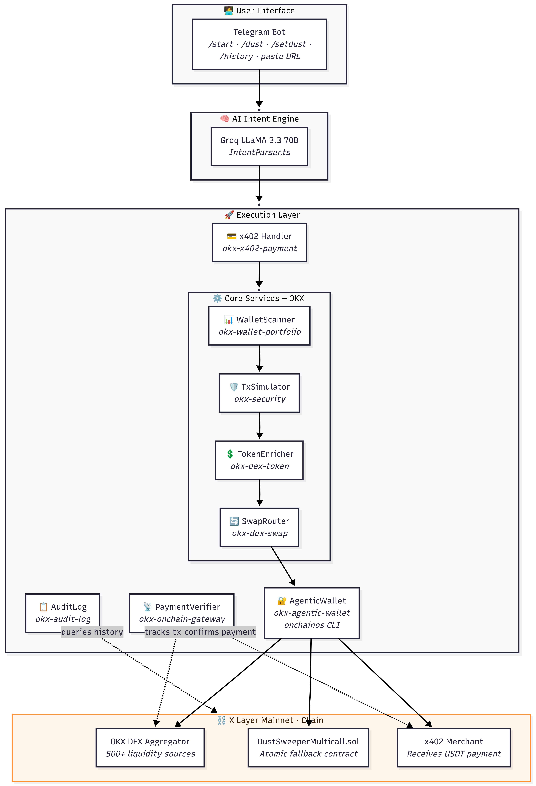
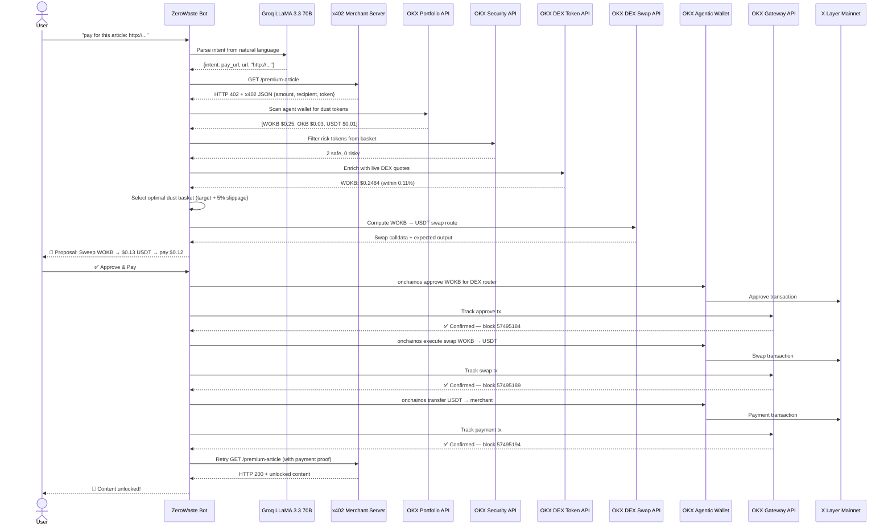

# ZeroWaste Protocol 🧹

> **Turn wallet dust into payments.** An AI-powered Telegram agent that automatically liquidates small, idle token balances ("dust") on X Layer into USDT to pay x402 paywalls — conversationally, autonomously, and with zero manual swaps.

[-orange)](https://www.okx.com/xlayer)
[](https://web3.okx.com/onchain-os)
[](https://dorahacks.io/hackathon/okx-xlayer/detail)
[](LICENSE)

---

## 📖 Project Introduction

Every crypto wallet accumulates small token balances — $0.07 of WOKB, $0.02 of USDC, $1.50 of some random token. Individually worthless, collectively these "dust" tokens represent billions in idle value across Web3. **ZeroWaste Protocol turns that trash into treasure.**

### The Problem
- Users accumulate tiny token balances that are too small to trade or use individually
- x402 paywalls require specific stablecoin payments that users may not have ready
- Manually swapping multiple small tokens is tedious, gas-inefficient, and often not worth the effort

### The Solution
A Telegram bot where users simply paste a paywalled URL (or ask in plain English), and the agent autonomously:
1. Detects the x402 payment requirement
2. Scans the user's agent wallet for all dust tokens
3. Filters out risky tokens, enriches prices with live DEX quotes
4. Selects the optimal dust basket and computes swap routes
5. Executes approve → swap → pay in sequence
6. Delivers the unlocked content — all in one interaction

```
You:  "pay for this article: https://merchant.xyz/premium"
Bot:  🔗 x402 Payment Required — $0.12 USDT to 0x2fBa...
      🔍 Scanning dust... 2 safe tokens, $0.26 total
      📊 WOKB live DEX price: $0.2484 (within 0.11% of portfolio)
      💱 Sweep 0.00145 WOKB → $0.13 USDT → pay merchant
      [✅ Approve & Pay]  [❌ Cancel]

You tap ✅ →
      ✅ WOKB approved (Gateway — block 57495184)
      ✅ Swap confirmed (Gateway — block 57495189)
      ✅ Merchant paid (Gateway — block 57495194)
      🎉 Content unlocked!
```

---

## 🏗️ Architecture Overview



### How the Layers Connect

| Layer | Role | Components |
|---|---|---|
| **User Interface** | Accepts natural language or URLs via Telegram | Bot command handlers, inline keyboards |
| **AI Engine** | Parses user intent from free-form text | Groq LLaMA 3.3 70B (IntentParser.ts) |
| **Core Services** | Scans, validates, prices, and routes dust tokens | WalletScanner → TxSimulator → TokenEnricher → SwapRouter |
| **Execution** | Signs txs, tracks confirmations, handles x402 protocol | AgenticWallet (onchainos CLI), PaymentVerifier, AuditLog |
| **Blockchain** | On-chain settlement on X Layer Mainnet | OKX DEX Aggregator, DustSweeperMulticall contract, merchant wallets |

---

## 📄 Deployment Address

### `DustSweeperMulticall.sol` — X Layer Mainnet

| Property | Value |
|---|---|
| **Contract Address** | [`0x1E52781EC86C99C972f30366dA493c780a54ED8c`](https://www.okx.com/web3/explorer/xlayer/address/0x1E52781EC86C99C972f30366dA493c780a54ED8c) |
| **Chain** | X Layer Mainnet (Chain ID: 196) |
| **Purpose** | Atomic multicall fallback — executes batched swap calls, verifies USDT output meets x402 requirement, forwards payment. Reverts entirely if output is insufficient, protecting user tokens. |

### Agent Wallet (Agentic OS)
Each user gets a dedicated TEE-secured agent wallet created via the OKX onchainos CLI. The bot creates and manages these wallets automatically on `/start`.

---

## 🔗 Onchain Verification

Transactions for verification:
- **Agent Wallet 1**: [0x1d56610a07f5f947ab2d6eb299495be03a1f8bb0](https://www.oklink.com/x-layer/address/0x1d56610a07f5f947ab2d6eb299495be03a1f8bb0/token-transfer)
- **Agent Wallet 2**: [0x2b74f006480c58781c886c2a2b5c03d8bceb2a12](https://www.oklink.com/x-layer/address/0x2b74f006480c58781c886c2a2b5c03d8bceb2a12/token-transfer)

---

## 🔧 Onchain OS Skill Usage (8 Skills Integrated)

| # | Skill | Service File | How It's Used |
|---|---|---|---|
| 1 | `okx-agentic-wallet` | `AgenticWallet.ts` | Creates a TEE-secured agent wallet per user via onchainos CLI. All on-chain transactions (approvals, swaps, transfers) are signed through this wallet with mutex-protected account switching for multi-user safety. |
| 2 | `okx-wallet-portfolio` | `WalletScanner.ts` | Queries the OKX Portfolio API (`/api/v5/wallet/asset/all-token-balances-by-address`) to discover all tokens in the user's agent wallet on X Layer, including balances, prices, and risk flags. |
| 3 | `okx-dex-swap` | `SwapRouter.ts` | Computes optimal swap routes via OKX DEX Aggregator V6 (`/api/v6/dex/aggregator/swap`) to convert each dust token → USDT. Routes are computed in parallel for multi-token baskets across 500+ DEX liquidity sources. |
| 4 | `okx-dex-token` | `TokenEnricher.ts` | Fetches live DEX quotes (`/api/v6/dex/aggregator/quote`) for each dust token before basket selection. If the live price diverges >2% from the portfolio price, the token's value is updated for more accurate swap decisions. |
| 5 | `okx-x402-payment` | `bot/index.ts` | Detects HTTP 402 responses from merchant servers, parses the `x402` JSON payment requirement (amount, recipient, token), and orchestrates the full payment flow from dust sweep to content delivery. |
| 6 | `okx-onchain-gateway` | `PaymentVerifier.ts` | After each transaction broadcast, polls the OKX Gateway API (`/api/v5/wallet/post-transaction/transaction-detail-by-txhash`) for confirmation status instead of relying solely on local RPC — providing OKX-verified finality. |
| 7 | `okx-security` | `TxSimulator.ts` | Pre-filters tokens flagged `isRiskToken: true` from the dust basket before any swap attempt. Prevents the agent from interacting with honeypot or malicious token contracts. |
| 8 | `okx-audit-log` | `AuditLog.ts` | Queries on-chain transaction history via OKX post-transaction API (`/api/v5/wallet/post-transaction/list-transactions-by-address`). Powers the `/history` bot command, giving users an immutable audit trail of all sweep payments. |

---

## 🔄 Working Mechanics

### The Checkout Loop — Step by Step



### Intelligent Checkout Scenarios

The ZeroWaste Protocol agent handles various real-world payment edge cases autonomously:

| Scenario | Logic & Trigger | User Benefit |
|---|---|---|
| **⚡ Direct Pay** | **Agent wallet already has sufficient stablecoin.** Skip DEX swaps entirely and execute a direct ERC20 transfer. | Zero swap fees, instant confirmation. |
| **📉 Partial Swap** | **A single dust token is larger than the required amount.** Bot calculates exact swap amount (including 5% slippage buffer) and leaves the remainder in your wallet. | "Dust conservation" — only spend what is necessary. |
| **🛡️ Security Shield** | **OKX Security flags a token as `isRiskToken: true`.** Agent automatically excludes it from the sweep basket before liquidation. | Protects you from interacting with honeypots or malicious contracts. |
| **🩹 Self-Healing Routing** | **DEX Aggregator rejects a tiny token balance.** The bot "blocklists" that token for the session, selects a new basket, and re-computes a safe route. | Resilience: the payment succeeds even if individual tokens fail to swap. |
| **🛒 Multi-token Sweep** | **No single token covers the price.** Agent aggregates multiple dust tokens, routes them in parallel via OKX DEX V6, and combines the output for the merchant. | Unlocks liquidity from tiny, fragmented balances. |
| **⚓ Multicall Fallback** | **Complex multi-swap operations.** Uses `DustSweeperMulticall.sol` to verify that the final USDT output meets the merchant's price before releasing user funds. | Atomic safety — the operation reverts if the output is insufficient. |

### Key Design Decisions

- **OKX DEX Aggregator over raw Uniswap** — Better fill rates for small, illiquid token swaps on X Layer
- **Sequential approve → swap** over atomic multicall — More reliable with varied ERC20 approval patterns
- **5% slippage buffer** in basket selection — Accounts for price movement between quote and execution
- **Parallel route computation** — All swap routes computed via `Promise.all` for speed
- **Groq LLaMA 3.3 70B** — Ultra-low latency inference (<200ms) for responsive conversational UX
- **Mutex-protected onchainos CLI** — Prevents concurrent account-switching conflicts in multi-user scenarios
- **Configurable dust threshold** — Users set their own definition of "dust" via `/setdust` (default: $50, range: $0.50–$500)

---

## 👥 Team Members

| Name | Role | GitHub |
|---|---|---|
| Sharwin | Full-stack development & architecture | [@Raksha001](https://github.com/Raksha001) |

---

## 🏆 Project Positioning in the X Layer Ecosystem

### Why X Layer?

X Layer's **ultra-low gas fees** (fractions of a cent per tx) are what make ZeroWaste Protocol economically viable. On Ethereum mainnet, the gas cost of swapping a $0.25 dust token would exceed the token's value. On X Layer, the agent can execute 3 transactions (approve + swap + transfer) for under $0.01 in gas — making micro-dust liquidation profitable for the first time.

### Ecosystem Contributions

| Dimension | Contribution |
|---|---|
| **Real-world x402 utility** | Not just a payment demo — a complete paywall detection → dust liquidation → payment → content delivery cycle operating on X Layer Mainnet with real transactions |
| **Deep Onchain OS integration** | 8 OKX Onchain OS skills integrated in a single coherent agent flow — portfolio scanning, DEX routing, security filtering, price enrichment, gateway tracking, audit logging, agentic wallet management, and x402 protocol handling |
| **Economy loop** | Idle dust tokens (dead capital) → USDT (active capital) → merchant revenue → content access → user value. A complete earn–pay–earn cycle that increases X Layer transaction volume and DEX utilization |
| **AI-native UX** | Users interact in natural language via Telegram, powered by Groq LLaMA 3.3 70B. No wallet UI, no manual swaps, no DEX navigation — just conversational payments |
| **Agentic autonomy** | The bot independently identifies, prices, validates, routes, and executes payments without human intervention beyond final approval — demonstrating the power of OKX's agentic infrastructure on X Layer |

---

## 🚀 Setup & Run

### Prerequisites

- Node.js 18+
- [Telegram Bot Token](https://t.me/BotFather)
- [OKX API credentials](https://web3.okx.com/onchain-os/dev-portal) (API key, secret, passphrase, project ID)
- [Groq API key](https://console.groq.com/keys) for natural language parsing
- OKB on X Layer for gas

### Installation

```bash
git clone https://github.com/Raksha001/ZeroWaste-Protocol.git
cd ZeroWaste-Protocol
npm install
```

### Configuration

```bash
cp .env.example .env
```

Required environment variables:
```
TELEGRAM_BOT_TOKEN=...
OKX_API_KEY=...
OKX_SECRET_KEY=...
OKX_PASSPHRASE=...
OKX_PROJECT_ID=...
GROQ_API_KEY=...
NETWORK=mainnet
DUST_SWEEPER_CONTRACT=0x1E52781EC86C99C972f30366dA493c780a54ED8c
```

### Run

```bash
npm run dev   # Starts both merchant server (:3001) and Telegram bot
```

### Bot Commands

| Command | Description |
|---|---|
| `/start` | Create your TEE-secured agent wallet |
| `/wallet` | View agent wallet address + explorer link |
| `/dust` | Scan for dust tokens in your wallet |
| `/setdust <n>` | Set your dust threshold (e.g. `/setdust 5` = tokens < $5) |
| `/history` | View on-chain sweep payment history |
| `/help` | Show all commands |
| _paste URL_ | Auto-detect x402 paywall and initiate sweep |
| _natural language_ | "pay for this article", "how much dust do I have?" |

---

## 📁 Project Structure

```
ZeroWaste-Protocol/
├── src/
│   ├── bot/index.ts              # Telegram bot — commands, NLP, payment flow
│   ├── services/
│   │   ├── AgenticWallet.ts      # onchainos CLI wrapper       (okx-agentic-wallet)
│   │   ├── WalletScanner.ts      # Dust token discovery        (okx-wallet-portfolio)
│   │   ├── SwapRouter.ts         # DEX route computation       (okx-dex-swap)
│   │   ├── TokenEnricher.ts      # Live DEX price enrichment   (okx-dex-token)
│   │   ├── TxSimulator.ts        # Risk filter + simulation    (okx-security)
│   │   ├── PaymentVerifier.ts    # Tx confirmation tracking    (okx-onchain-gateway)
│   │   ├── AuditLog.ts           # Transaction history         (okx-audit-log)
│   │   ├── IntentParser.ts       # Groq LLaMA 3.3 NLP
│   │   ├── OkxApiClient.ts       # HMAC-authenticated API client
│   │   └── UserWalletStore.ts    # Persistent user preferences
│   ├── merchant/server.ts        # Mock x402 paywall server
│   ├── config/network.ts         # X Layer network config
│   ├── scripts/                  # Setup & funding utilities
│   └── test/                     # E2E test runner
├── contracts/
│   └── DustSweeperMulticall.sol  # Atomic swap fallback contract
└── docs/
    └── architecture.svg          # Architecture diagram
```

---

## 📜 License

MIT
